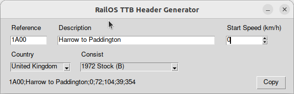

</img>

# Timetable Service Header Creator

_RailOSConsist_ is a small utility for quickly generating the first line of a service timetable entry in [Railway Operation Simulator](https://www.railwayoperationsimulator.com/) (RailOS) using existing consists. Currently the utility makes use of data assembled by Discord user _Mark "The Jinx"_ on the RailOS server for entries describing UK rolling stock with the plan to add entries for other countries at a later date.

## Creating Headers

The application is easy to use, just select a country from the dropdown and then a consist. Fill in the additional information and the header string will automatically be created. Use the _Copy_ button to copy the string to your clipboard.

When updating the start speed by typing values as opposed to adjusting with the spinbox, hit the `Enter` key to update the header.

